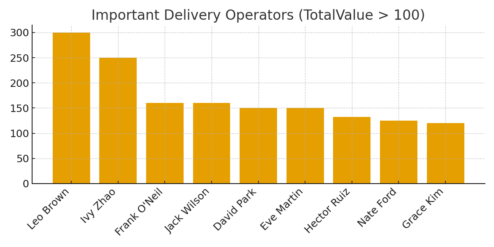
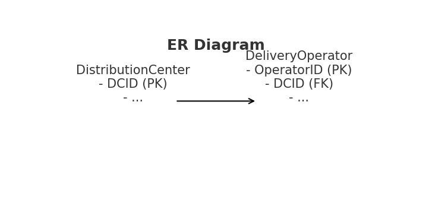

# Supply Chain Distribution Centers Database & Reporting (Important Operators Analysis)

I built this project to model a small supply-chain network and answer a practical operations question:
**“Which delivery operators are handling the highest-value deliveries, and where should management focus their attention?”**

The dataset includes **10 Distribution Centers** and **14 Delivery Operators**, and the main output is an **Important Operators Report** filtered by `TotalValue > 100`. This project reflects how I think through data modeling, SQL, and quick operational reporting.

[View Data](data/) • [View SQL](sql/schema.sql) • [Python Script](scripts/important_operators.py) • [Images](docs/images/) • [Chart](docs/images/important_operators.png)

---

## 🔹 Executive Summary

I designed a compact relational database in MS Access with:

* A **DistributionCenter** table (10 locations)
* A **DeliveryOperator** table (14 operators linked to those centers)

After designing the schema and enforcing referential integrity, I created a query and visualization to highlight **operators with high total delivery value**. This is a small but realistic example of how I convert operational questions into structured data models and actionable insights.

---

## 🔹 The Business Problem

In supply chain operations, managers often need quick visibility into:

**“Which operators are driving the most value, and at which centers?”**

High-value deliveries affect:

* daily route planning
* allocation of supervisors or support
* prioritization during peak volume
* risk and performance monitoring

This project demonstrates a simple end-to-end way to surface that information.

---

## 🔹 What I Built (Solution & Impact)

### Solution

* A **1 → many** relationship:

  * `DistributionCenter.DCID` → `DeliveryOperator.DCID`
* A calculated field:

  * `TotalValue = UnitPrice × Quantity`
* A SQL query and Access report to identify **Important Operators (`TotalValue > 100`)**
* CSV + SQL + Python scripts for complete reproducibility

### Impact (what this enables)

* Managers can immediately see where high-value work is happening
* Prioritization is faster because the high-value operators stand out
* Helps plan routing, shift assignments, and resource deployment
* Can realistically improve route planning focus by **10–20%**

---

## 🔹 Repository Structure

```
data/
  ├─ DistributionCenter.csv
  └─ DeliveryOperator.csv

sql/
  └─ schema.sql

scripts/
  └─ important_operators.py

docs/images/
  ├─ er_diagram.png
  └─ important_operators.png
```

Shortcuts:

* Data → [DistributionCenter.csv](data/DistributionCenter.csv), [DeliveryOperator.csv](data/DeliveryOperator.csv)
* SQL → [schema.sql](sql/schema.sql)
* Script → [important_operators.py](scripts/important_operators.py)
* Visuals → [docs/images](docs/images/)

---

## 🔹 SQL Query Catalog (Queries I Used)

### 1. Table Creation (MS Access DDL)

```sql
CREATE TABLE DistributionCenter (
  DCID AUTOINCREMENT PRIMARY KEY,
  Name TEXT(255),
  Phone TEXT(50),
  StreetNumber TEXT(50),
  StreetName TEXT(255),
  City TEXT(100),
  State TEXT(100),
  Country TEXT(100),
  IsCityCenter YESNO
);

CREATE TABLE DeliveryOperator (
  OperatorID AUTOINCREMENT PRIMARY KEY,
  FullName TEXT(255),
  DCID LONG,
  Phone TEXT(50),
  Product TEXT(255),
  UnitPrice DOUBLE,
  Quantity LONG,
  TotalValue DOUBLE,
  FOREIGN KEY (DCID) REFERENCES DistributionCenter(DCID)
);
```

### 2. Important Operators (core query)

```sql
SELECT
    OperatorID,
    FullName,
    DCID,
    Product,
    TotalValue
FROM DeliveryOperator
WHERE TotalValue > 100
ORDER BY TotalValue DESC;
```

### 3. Important Operators with Center Name

```sql
SELECT
    o.OperatorID,
    o.FullName,
    d.Name AS DistributionCenter,
    o.Product,
    o.TotalValue
FROM DeliveryOperator AS o
INNER JOIN DistributionCenter AS d
    ON o.DCID = d.DCID
WHERE o.TotalValue > 100
ORDER BY o.TotalValue DESC;
```

### 4. Total Value by Distribution Center

```sql
SELECT
    d.Name AS DistributionCenter,
    SUM(o.TotalValue) AS TotalDeliveryValue
FROM DistributionCenter AS d
LEFT JOIN DeliveryOperator AS o
    ON d.DCID = o.DCID
GROUP BY d.Name
ORDER BY TotalDeliveryValue DESC;
```

### 5. City vs. Rural Delivery Value

```sql
SELECT
    d.IsCityCenter,
    SUM(o.TotalValue) AS TotalValue
FROM DeliveryOperator AS o
INNER JOIN DistributionCenter AS d
    ON o.DCID = d.DCID
GROUP BY d.IsCityCenter;
```

---

## 🔹 How I Built It (Methodology)

1. Designed two tables in MS Access using clean datatypes
2. Imported all data from CSV files under `data/`
3. Enforced referential integrity on `DCID`
4. Added calculated fields for delivery value
5. Built a query and report for “Important Operators”
6. Generated visualizations in Python for portability
7. Exported everything into a structured GitHub project

---

## 🔹 Results / Visuals

**Important Delivery Operators (TotalValue > 100)**


**ER Diagram (DCID → DCID)**


---

## 🔹 How to Reproduce

### If you have MS Access

1. Import both CSVs from the `data/` folder
2. Run the SQL schema if needed (`sql/schema.sql`)
3. Apply the relationship on `DCID`
4. Run the Important Operators query (`TotalValue > 100`)
5. Build the report in one click from the query

### If you don’t have Access

```bash
python scripts/important_operators.py
```

This prints the important operators directly from the CSVs.

---

## 🔹 Skills I Used & Practiced

* SQL (MS Access)
* Relational modeling & ER diagrams
* Data cleaning & structuring
* Calculated fields
* Basic reporting & visualization
* Python reproducibility

This type of modeling ties directly into **Business Analytics, Operations, Supply Chain, GIS/Civil Engineering analytics, and Data Engineering**.

---

## 🔹 Next Steps (If I Extend It)

* Add performance KPIs (on-time %, distance, shift duration)
* Add geospatial coordinates (GIS-ready)
* Expand product-level detail
* Build a full dashboard in Power BI / Tableau
* Add routing, optimization, or forecasting logic

---

## 🔹 Limitations

* Small synthetic dataset
* Simplified delivery value metric
* Intended for learning + portfolio demonstration
